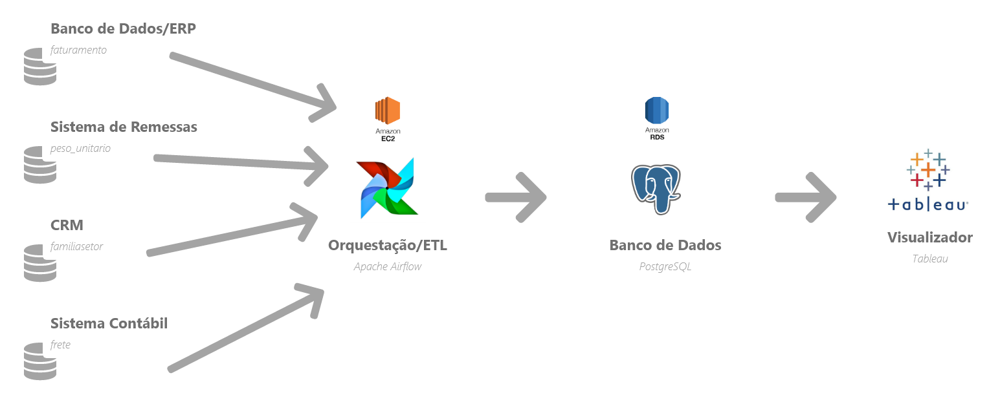

# Proposta de Arquitetura de Dados

O **objetivo** dessa proposta é apresentar um cenário simples para automatizar e organizar todas as fontes/coletas de dados, sem prejudicar o time de negócios que não pode depender ~~muito~~ do time de Engenharia/BI. Os dados serão **atualizados** *diariamente* (D-1).

A proposta é divida em duas partes, com suas subdivisões:

1. **Elementos:** 
   1. Fontes de Dados
   2. Ferramentas
2. **Arquitetura**

---

## Fontes de Dados

##### Elementos

Cada fonte de dados tem sua particularidade ou horário. Vou citar rapidamente cada fonte e tabela, além de abordar a especificidade. Para entrar em detalhes, [vá no Readme do projeto aqui](https://github.com/israelmendez232/teste-data-analytics/blob/master/README.md).

1. **Banco de Dados/ERP:** Fornece acesso aos dados para *faturamento*. Só permite conexão às bases de dados no horário fixo das 00:00 até 04:00;
2. **Sistema de Remessas:** Dados para tabela *peso_unitario*, acesso por uma VPN. Só permite conexão às bases de dados no horário fixo das 00:00 até 04:00;
3. **CRM:** Dados para tabela *familiasetor*, acesso por uma API. Tem momentos curtos (1 à 5 minutos) de indisponibilidade devido ao grande volume de acessos;
4. **Sistema Contábil:** Dados para tabela *frete*, tem um “endpoint” com histórico disponível.

## Ferramentas

##### Elementos

Cada ferramenta foi pensada com o objetivo principal (solução fácil para uso do usuário final) e também nas especificidades citadas de cada fonte de dados:

- **Orquestação/ETL:** *Apache Airflow + AWS EC2* ajuda na organizar e pensar em cada detalhe das fontes de dados. Usando DAGs com comportamentos específicos, fariamos um ETL completo e até subDAGs para cada fonte, pensando em suas características. E para manter a instância, iriamos usar AWS EC2 para guardar o Airflow na nuvem;
- **Linguagem:** *Python* é a principal linguagem para rodar o Airflow. Sem falar que é possível ser usado junto com PySpark para streaming de dadosm caso seja necessário no futuro;
- **Data Warehouse:** *AWS RDS + PostgreSQL*. AWS vai ajudar a colocar na nuvem por um preço acessível, enquanto o PostgreSQL vai fornecer uma estrutura estável e open source para gerenciar o banco de dados relacional para análise;
- **Visualizador:** *Tableau*. Ele é conhecido por ser mais fácil para os usuários de negócio. Sem falar que é famoso no mundo inteiro por ser uma solução completa e ótima para análises exploratórias. Não precisa usar SQL (como Metabase) ou Modelagens mais complexas (como Power BI). Sem falar que o Tableau consegue ler facilmente o DW criado no AWS.

---

## Arquitetura

A imagem explica a arquitetura de maneira superficial, mas vamos abordar o principal de cada etapa aqui:

1. **Airflow** vai conectar e puxar os dados de cada fonte. Extraíndo, transformando e enviando os dados para o banco de dados.
2. **PostgreSQL** vai fazer os joins e tabelas extras que forem solicitadas pelo time de negócios, mas como os dados já estarão limpos e no formato correto, ele já pode ser lido diretamente pelo visualizador;
3. **Tableau** vai ser usado para ler e explorar os dados.

Todas as etapas acima são automatizadas e sem necessidades de manter o time de engenharia/BI por perto. Claro que será necessário uma manutenção constante, mas o objetivo foi cumprido :)
